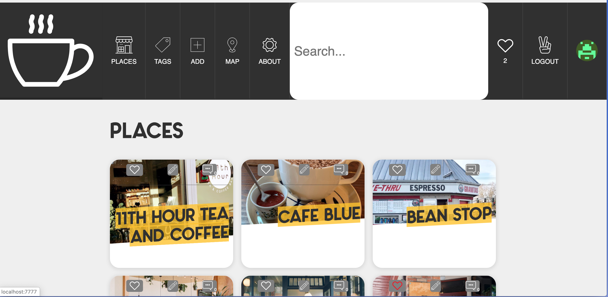

# What's Good
A project to learn NodeJS and have a little fun. Currently no live deployment

I worked through this project over a significant period of time, I have revisited and started adding features. 

This ReadMe needs:

* Instructions for setting up environment variables and Mongodb database

Things I learned from this project include about:

* Async Await

* Mixins

* Pug Templating

* Express Routing

* MongoDb Aggregations

  

There is still a lot in the project I don't fully understanding including WebPack. 

