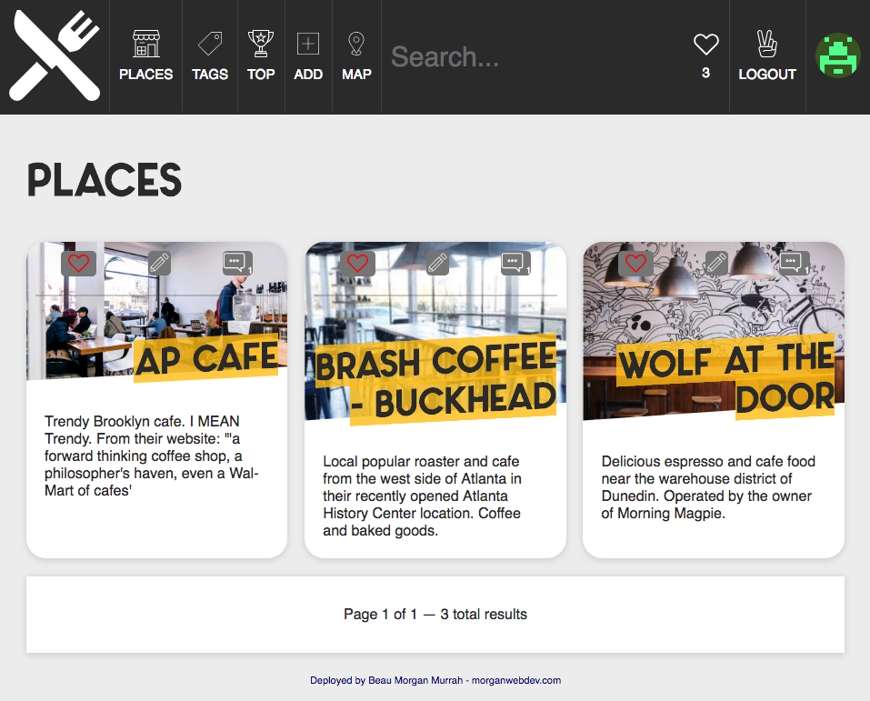

# What's Good
A project to learn NodeJS and have a little fun. 

###[Live Deployment of App: https://whatsgood.site](https://whatsgood.site/)


## Getting Started

These instructions will get you a copy of the project up and running on your local machine for development and testing purposes. See deployment for notes on how to deploy the project on a live system.


## Screenshot 




### Prerequisites

1. Node 7.6+
2. npm
3. Jade/Pug text-editor language support 

```
Node
MongoDB
Environment Variables
```

### Installing

1. Clone this repository

`git clone https://github.com/airbr/whatsgood.git`

2. cd && npm install

`npm install`

3. Link up MongoDB Database to Application.

Suggested: Mlab 

*TODO:*

## Running the tests TODO: Add Tests...

Explain how to run the automated tests for this system

## Deployment

Add additional notes about how to deploy this on a live system

## Built With

* [NodeJS]() 
* [MongoDB]()

## Versioning/History
